

**Workshop Administrasi Jaringan**

Diampu oleh 
Dr. Ferry Astika Saputra ST, M.Sc.

** Praktikum 1: Manajemen Sistem**

 Disusun Oleh 
Rizka Dwi Fajriyah Darmayanti 
3121600050; 2 D4 IT B

   PROGRAM STUDI TEKNIK INFORMATIKA 
POLITEKNIK ELEKTRONIKA NEGERI SURABAYA 
PEMERINTAH KOTA SURABAYA 
TAHUN 2023 

  

# Evolusi OS Debian - Ubuntu
Debian dan Ubuntu adalah dua sistem operasi Linux yang sangat populer. Ubuntu sebenarnya berbasis pada Debian, sehingga evolusi Debian juga mempengaruhi Ubuntu. Namun, ada beberapa perbedaan antara keduanya, antara lain:

1.	Tujuan: Debian dikembangkan dengan fokus pada stabilitas dan keamanan, sementara Ubuntu dirancang untuk menjadi sistem operasi yang mudah digunakan dan ramah pengguna.
2.	Model Pengembangan: Debian menggunakan model pengembangan yang didasarkan pada kontribusi sukarela dari komunitas pengembang yang terdiri dari ribuan orang, sedangkan Ubuntu dikembangkan oleh Canonical Ltd. sebagai perusahaan swasta.
3.	Siklus Rilis: Debian merilis versi stabil ketika sudah siap, sehingga waktu antar rilisnya bisa cukup lama, sementara Ubuntu merilis versi baru setiap enam bulan sekali dengan dukungan jangka pendek dan setiap dua tahun sekali dengan dukungan jangka panjang (LTS).
4.	Paket: Debian memiliki jumlah paket yang lebih banyak daripada Ubuntu dan cenderung lebih stabil, karena pengembang Debian lebih memperhatikan keamanan dan kualitas paket. Namun, Ubuntu lebih mengutamakan paket yang dibutuhkan oleh pengguna desktop dan laptop.
5.	Perangkat Keras: Karena Ubuntu lebih baru daripada Debian, ia lebih cenderung memiliki dukungan perangkat keras yang lebih baik. Namun, Debian menyediakan dukungan untuk lebih banyak arsitektur perangkat keras dan lebih stabil dalam memelihara driver yang lebih lama.
6.	Desktop Environment: Ubuntu secara default menggunakan desktop environment Unity, sementara Debian tidak menggunakan desktop environment bawaan dan pengguna harus menginstal desktop environment yang mereka inginkan.
7.	Komunitas: Debian memiliki komunitas yang lebih besar dan lebih terbuka, sedangkan Ubuntu memiliki komunitas yang lebih kecil dan lebih terpusat pada Canonical Ltd. sebagai pengembang utama.

 
Berikut adalah beberapa tonggak utama dalam evolusi Debian dan Ubuntu:

1.	Debian 0.01 dirilis pada September 1993 dan merupakan versi pertama Debian yang tersedia untuk umum. Debian dikembangkan sebagai distribusi Linux yang stabil dan dapat diandalkan dengan fokus pada keamanan dan stabilitas.
2.	Pada tahun 2004, Mark Shuttleworth mendirikan Canonical Ltd. dan mengembangkan Ubuntu, sebuah distribusi Linux yang berbasis pada Debian. Ubuntu dirilis untuk pertama kalinya pada Oktober 2004 dengan tujuan untuk menyediakan distribusi Linux yang mudah digunakan dan ramah pengguna.
3.	Debian 4.0 (Etch) dirilis pada April 2007 dengan peningkatan dalam manajemen paket, instalasi otomatis, dan dukungan hardware yang lebih baik.
4.	Ubuntu 7.04 (Feisty Fawn) dirilis pada April 2007 dan merupakan versi pertama Ubuntu yang menyediakan dukungan untuk desktop dan laptop.
5.	Debian 6.0 (Squeeze) dirilis pada Februari 2011 dengan peningkatan dalam manajemen paket dan dukungan untuk arsitektur prosesor baru.
6.	Ubuntu 12.04 (Precise Pangolin) dirilis pada April 2012 dan merupakan versi Ubuntu yang memiliki dukungan jangka panjang (LTS) selama 5 tahun.
7.	Debian 7.0 (Wheezy) dirilis pada Mei 2013 dengan peningkatan dalam manajemen paket, dukungan hardware, dan keamanan.
8.	Ubuntu 14.04 (Trusty Tahr) dirilis pada April 2014 dan merupakan versi Ubuntu LTS dengan dukungan selama 5 tahun.
9.	Debian 8.0 (Jessie) dirilis pada April 2015 dengan peningkatan dalam manajemen paket dan dukungan untuk arsitektur prosesor baru.
10.	Ubuntu 16.04 (Xenial Xerus) dirilis pada April 2016 dan merupakan versi Ubuntu LTS dengan dukungan selama 5 tahun.
11.	Debian 9.0 (Stretch) dirilis pada Juni 2017 dengan peningkatan dalam manajemen paket, dukungan hardware, dan keamanan.
12.	Ubuntu 18.04 (Bionic Beaver) dirilis pada April 2018 dan merupakan versi Ubuntu LTS dengan dukungan selama 5 tahun.
13.	Debian 10.0 (Buster) dirilis pada Juli 2019 dengan peningkatan dalam manajemen paket dan dukungan untuk arsitektur prosesor baru.
14.	Ubuntu 20.04 (Focal Fossa) dirilis pada April 2020 dan merupakan versi Ubuntu LTS dengan dukungan selama 5 tahun.

 

# Perintah "su" Ubuntu
 Perintah "su" (singkatan dari "switch user") digunakan untuk beralih ke akun superuser atau root secara penuh, sehingga pengguna dapat menjalankan perintah atau tugas yang memerlukan izin akses khusus. Untuk menggunakan perintah "su", pengguna harus memasukkan kata sandi root untuk memverifikasi identitas mereka. Setelah itu, pengguna akan dianggap sebagai pengguna root dan memiliki akses penuh ke sistem. Selai itu, perintah "su" masih dibutuhkan dalam situasi tertentu ketika pengguna memerlukan akses penuh ke sistem.

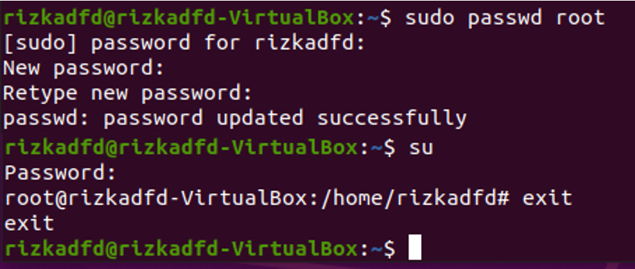

  

# Perintah "sudo" Ubuntu
Perintah "sudo" (singkatan dari "superuser do") memungkinkan pengguna untuk menjalankan perintah sebagai pengguna dengan hak akses superuser atau root tanpa perlu beralih ke akun superuser secara penuh. Dalam hal ini, pengguna hanya perlu menambahkan "sudo" di awal perintah yang akan dijalankan dan memasukkan kata sandi mereka untuk memverifikasi identitas. Dengan demikian, pengguna hanya diberi hak akses superuser untuk perintah tertentu dan tidak memiliki akses penuh ke sistem seperti ketika menggunakan perintah "su". Jadi perintah "sudo" memberikan akses terbatas ke perintah atau tugas tertentu. Perintah "sudo" lebih disukai untuk penggunaan sehari-hari, karena lebih aman dan mengurangi risiko pengguna melakukan kesalahan yang merugikan sistem.

 

# Package Maintance
Pemeliharaan paket pada Ubuntu adalah proses menjaga keamanan, stabilitas, dan ketersediaan paket perangkat lunak pada sistem operasi Ubuntu dengan memperbarui, memperbaiki, dan memantau paket perangkat lunak. Ubuntu menggunakan sistem manajemen paket APT (Advanced Package Tool) yang memudahkan administrator sistem untuk memperbarui dan memelihara paket perangkat lunak.
Beberapa tugas yang termasuk dalam pemeliharaan paket pada Ubuntu adalah sebagai berikut:

1.	Update: Administrator sistem harus memperbarui paket perangkat lunak secara teratur untuk memastikan sistem operasi aman dan berfungsi dengan baik. Dalam Ubuntu, pembaruan paket perangkat lunak dapat dilakukan melalui Terminal atau Ubuntu Software Center.
2.	Upgrade: Upgrade adalah proses memperbarui versi Ubuntu yang sedang digunakan ke versi yang lebih baru. Administrator sistem harus memperbarui versi Ubuntu secara teratur untuk mendapatkan fitur baru, perbaikan bug, dan pembaruan keamanan.
3.	Perbaikan bug: Administrator sistem harus memperbaiki bug yang terkait dengan paket perangkat lunak tertentu. Ini melibatkan memeriksa laporan bug, menentukan penyebabnya, dan mengembangkan solusi untuk memperbaikinya.
4.	Pemantauan: Administrator sistem harus memantau ketersediaan dan kinerja paket perangkat lunak pada sistem operasi Ubuntu. Ini meliputi memeriksa ketersediaan update dan memonitor penggunaan CPU dan memori oleh paket perangkat lunak tertentu.
5.	Penghapusan: Dalam beberapa kasus, paket perangkat lunak tertentu mungkin tidak lagi diperlukan pada sistem operasi Ubuntu. Administrator sistem harus menghapus paket tersebut untuk menghemat ruang penyimpanan dan meningkatkan kinerja sistem.

Dalam Ubuntu, pengguna dapat menggunakan beberapa perintah untuk melakukan pemeliharaan paket, seperti apt-get untuk menginstal dan menghapus paket perangkat lunak, apt-cache untuk memeriksa informasi paket perangkat lunak, dan dpkg untuk memeriksa dan mengelola paket yang diinstal pada sistem. Dengan melakukan pemeliharaan paket secara teratur, administrator sistem dapat memastikan keamanan dan stabilitas sistem operasi Ubuntu.

 

## Setting repository ubuntu

Untuk mengatur repository di Ubuntu, Anda dapat mengikuti langkah-langkah berikut:

1.	Buka Ubuntu Software Center atau Synaptic Package Manager. Kedua aplikasi ini dapat digunakan untuk mengatur repository pada Ubuntu.
2.	Pilih menu "Settings" atau "Preferences" dan cari opsi "Repositories" atau "Software Sources".
3.	Pilih tab "Ubuntu Software" atau "Software Sources" dan pastikan bahwa kotak-kotak yang sesuai dengan repository yang ingin Anda aktifkan sudah dicentang.
4.	Jika Anda ingin menambahkan repository pihak ketiga, pilih tab "Other Software" atau "Third-Party Software" dan klik tombol "Add" atau "Add Repository".
5.	Masukkan URL repository pihak ketiga yang ingin Anda tambahkan dan klik "Add Source" atau "Add Repository".
6.	Setelah selesai menambahkan repository, jangan lupa untuk menyimpan perubahan dan melakukan pembaruan paket perangkat lunak untuk mengaktifkan repository baru.

Dalam beberapa kasus, Anda mungkin perlu mengatur repository melalui terminal. Untuk melakukan ini, buka terminal dan jalankan perintah "sudo nano /etc/apt/sources.list" untuk membuka file konfigurasi repository. Anda dapat menambahkan atau menghapus repository dari file ini sesuai dengan kebutuhan Anda. Setelah menyimpan perubahan, jalankan perintah "sudo apt update" untuk memperbarui daftar paket perangkat lunak yang tersedia.

 

## Arti dari versi repository ubuntu

Repository Ubuntu adalah sebuah server atau kumpulan server yang berisi paket perangkat lunak yang dapat diinstal pada sistem operasi Ubuntu. Paket perangkat lunak ini tersedia secara online dan dapat diunduh dan diinstal melalui manajer paket Ubuntu.

Repository Ubuntu terdiri dari dua jenis, yaitu repository resmi dan repository pihak ketiga. Repository resmi Ubuntu disediakan oleh Canonical, pengembang Ubuntu, dan berisi paket perangkat lunak yang disetujui dan diuji secara intensif untuk digunakan pada sistem operasi Ubuntu.Repository resmi ini juga menyediakan pembaruan keamanan dan perbaikan bug.

Sementara itu, repository pihak ketiga adalah kumpulan paket perangkat lunak yang dikembangkan oleh komunitas pengembang Ubuntu dan tidak disediakan oleh Canonical. Biasanya, repository pihak ketiga menyediakan paket perangkat lunak yang tidak tersedia di repository resmi, atau versi yang lebih baru dari paket yang sudah ada di repository resmi.

Repository Ubuntu sangat penting dalam pengelolaan paket perangkat lunak pada sistem operasi Ubuntu. Dengan mengatur repository Ubuntu yang tepat, pengguna Ubuntu dapat dengan mudah mengunduh dan menginstal paket perangkat lunak yang mereka butuhkan untuk menjalankan tugas dan aktivitas sehari-hari mereka. Selain itu, repository Ubuntu juga membantu pengguna Ubuntu dalam memperbarui sistem operasi dan menjaga keamanannya dengan menyediakan pembaruan keamanan dan perbaikan bug secara teratur.

 

## Contoh instalasi package

### a.	Perintah mc

Perintah "mc" pada Ubuntu merupakan singkatan dari "Midnight Commander". Midnight Commander adalah sebuah file manager yang berjalan pada terminal. Berikut adalah beberapa perintah dasar untuk menggunakan Midnight Commander pada Ubuntu:

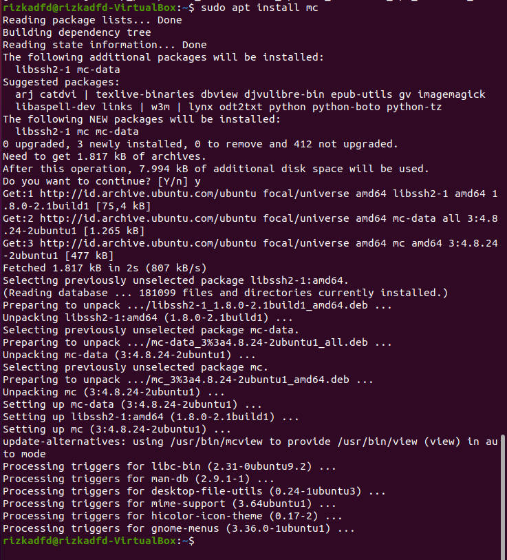

1. Tombol panah kiri dan kanan digunakan untuk memilih antara dua panel Midnight Commander. Panel kiri menampilkan direktori lokal, sedangkan panel kanan menampilkan direktori jarak jauh (jika digunakan untuk mengakses file dari server).

2. Untuk memindahkan file atau folder dari satu panel ke panel lain, gunakan tombol "F5" atau "F6". "F5" digunakan untuk menyalin file/folder, sedangkan "F6" digunakan untuk memindahkan file/folder.

3. Untuk menghapus file/folder, gunakan tombol "F8".

4. Untuk mengubah nama file/folder, gunakan tombol "F6".

5. Untuk membuka file teks atau file binary pada Midnight Commander, cukup tekan tombol "Enter".

6. Untuk keluar dari Midnight Commander, tekan tombol "F10".

Perintah-perintah di atas adalah perintah dasar Midnight Commander pada Ubuntu. Anda dapat menemukan perintah-perintah lain yang lebih lanjut di dokumentasi resmi Midnight Commander.

 

### b.	Perintah net tools

Perintah "net-tools" pada Ubuntu adalah seperangkat utilitas untuk mengelola jaringan yang telah lama digunakan di sistem operasi Linux. Beberapa perintah yang umum digunakan dalam paket net-tools adalah:

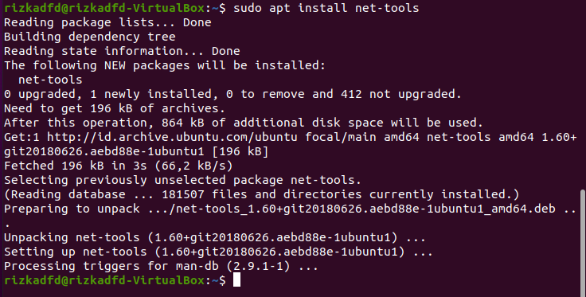

**ifconfig**: digunakan untuk menampilkan dan mengkonfigurasi antarmuka jaringan pada sistem. Contoh penggunaan:

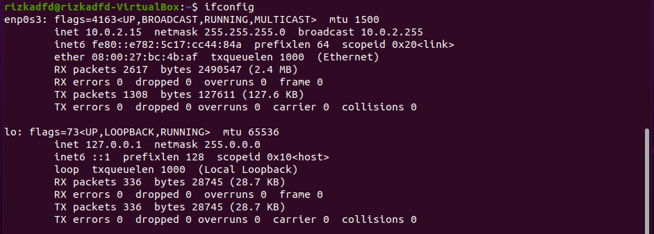

**route**: digunakan untuk menampilkan dan mengelola tabel routing pada sistem. Contoh penggunaan:

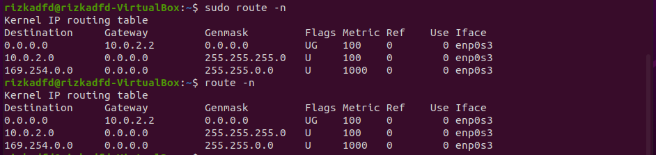

**netstat**: digunakan untuk menampilkan statistik koneksi jaringan dan port yang sedang digunakan pada sistem. Contoh penggunaan:

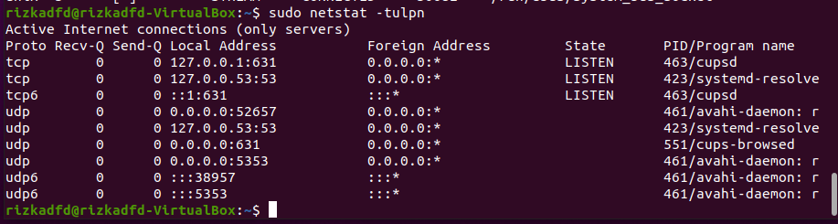

**arp**: digunakan untuk menampilkan dan mengelola tabel ARP pada sistem. Contoh penggunaan:

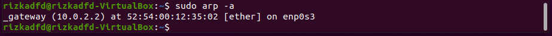

**hostname**: digunakan untuk menampilkan atau mengatur nama host pada sistem. Contoh penggunaan:

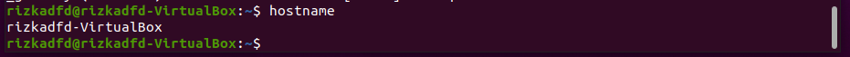

**dnsdomainname**: digunakan untuk menampilkan nama domain DNS pada sistem. Contoh penggunaan:

**iptunnel**: digunakan untuk mengatur tunnel IP pada sistem. Contoh penggunaan:

Perintah-perintah di atas adalah beberapa perintah yang umum digunakan dalam paket net-tools pada Ubuntu. Namun, beberapa perintah telah dianggap usang dan digantikan oleh perintah yang lebih baru seperti iproute2. Anda dapat menemukan informasi lebih lanjut tentang penggunaan net-tools dengan menjalankan perintah "man" untuk setiap perintah di atas.

  
 
### c.	Perintah htop

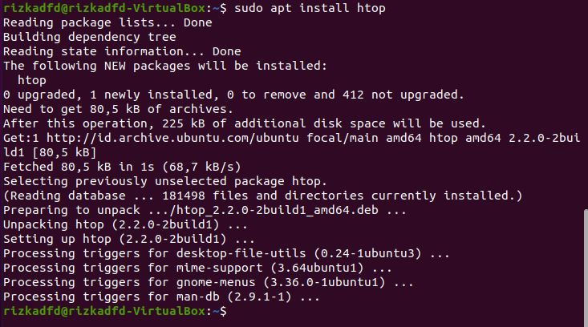

Perintah "htop" pada Ubuntu adalah sebuah utilitas yang digunakan untuk memantau kinerja sistem pada level proses. Htop merupakan pengganti dari perintah "top" bawaan sistem operasi Linux, dengan tampilan yang lebih interaktif dan informatif. Berikut adalah beberapa perintah yang umum digunakan dalam utilitas htop pada Ubuntu:

1. Untuk menjalankan htop, cukup ketikkan perintah berikut pada terminal:

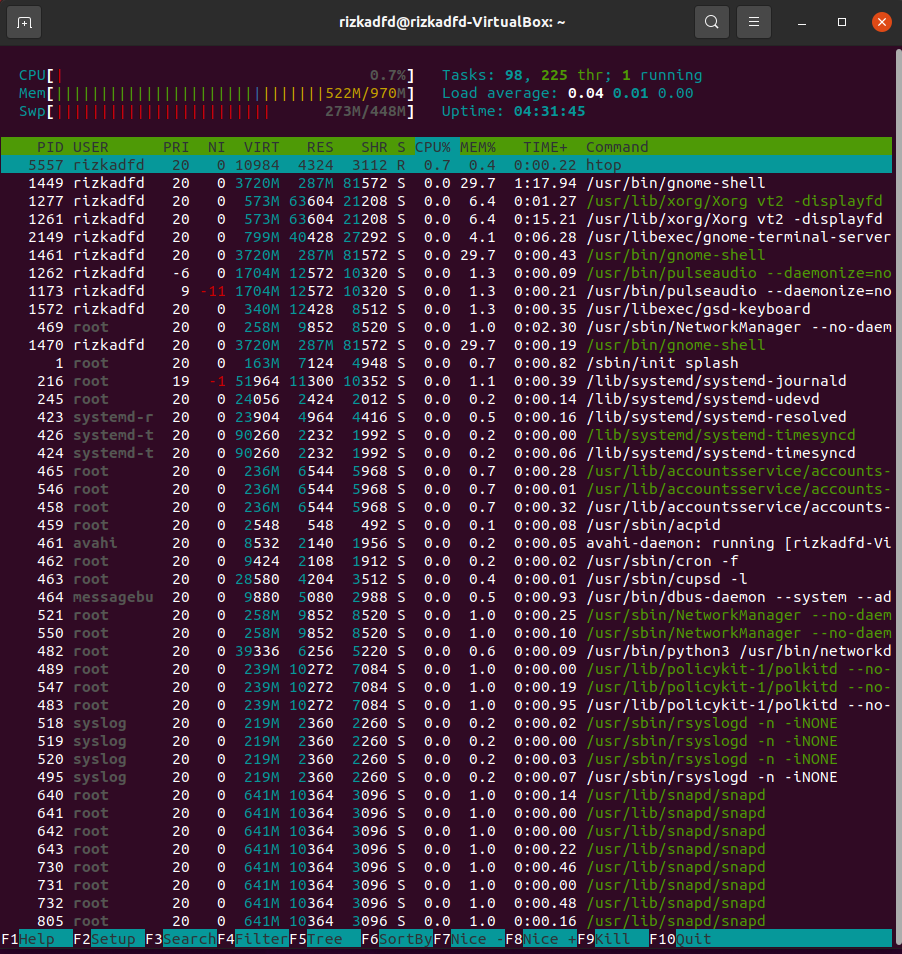

1. Saat dijalankan, htop akan menampilkan daftar proses yang sedang berjalan pada sistem, diurutkan berdasarkan penggunaan CPU.

2. Untuk mengurutkan daftar proses berdasarkan parameter lain, seperti penggunaan memori, waktu CPU, dan sebagainya, tekan tombol F6 dan pilih parameter yang diinginkan.

3. Untuk membatalkan pengurutan, tekan tombol F6 dan pilih "Reset sorting".

4. Untuk menghentikan sebuah proses, arahkan kursor ke proses yang diinginkan dan tekan tombol F9. Kemudian, pilih opsi "SIGTERM" untuk mengirim sinyal berhenti ke proses.

5. Untuk keluar dari htop, tekan tombol "Q".

Perintah-perintah di atas adalah beberapa perintah dasar yang umum digunakan dalam utilitas htop pada Ubuntu. Anda dapat menemukan lebih banyak perintah dan opsi dengan mengeksplorasi dokumentasi resmi dari htop.

  

# Perbedaan antara repository main security dan main contrib ubuntu
 
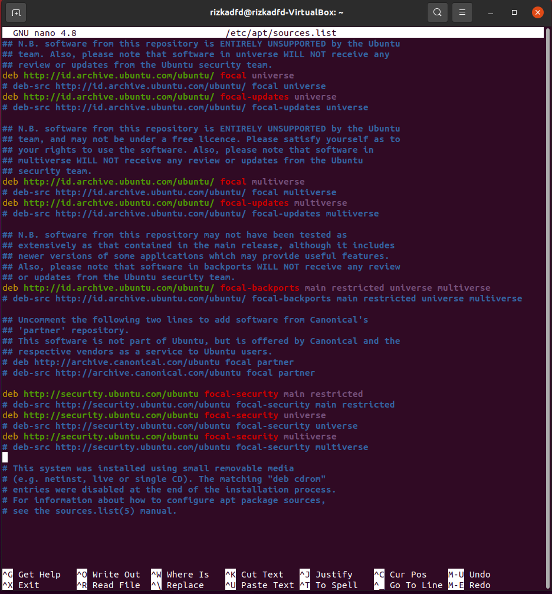

Repository main security dan main contrib Ubuntu adalah dua jenis repository resmi Ubuntu yang menyediakan paket perangkat lunak yang disetujui dan diuji secara intensif untuk digunakan pada sistem operasi Ubuntu.
Perbedaan antara keduanya adalah sebagai berikut:

- Repository main security: repository ini berisi paket perangkat lunak yang penting dan berhubungan dengan keamanan sistem. Paket yang tersedia di repository ini difokuskan pada pembaruan keamanan untuk paket yang ada di repository main.

- Repository main contrib: repository ini berisi paket perangkat lunak yang tidak terlalu penting dan mungkin tidak berhubungan dengan keamanan sistem. Paket yang tersedia di repository ini dikembangkan oleh komunitas pengembang Ubuntu atau pengembang perangkat lunak lain dan tidak disetujui oleh Canonical, pengembang Ubuntu.

Sedangkan untuk perbedaan dengan repository universe dan multiverse Ubuntu:

- Repository universe: repository ini berisi paket perangkat lunak bebas yang dikembangkan oleh komunitas pengembang Ubuntu. Paket yang tersedia di repository ini tidak diuji secara intensif dan tidak disetujui oleh Canonical.

- Repository multiverse: repository ini berisi paket perangkat lunak yang berisi komponen yang tidak bebas. Paket yang tersedia di repository ini juga tidak diuji secara intensif dan tidak disetujui oleh Canonical.

Dalam penggunaannya, pengguna Ubuntu dapat memilih repository mana yang ingin diaktifkan dan diatur pada sistem mereka. Repository main dan main security disarankan untuk diaktifkan untuk menjaga keamanan dan stabilitas sistem operasi Ubuntu. Sedangkan repository universe, multiverse, dan contrib dapat diaktifkan jika dibutuhkan oleh pengguna Ubuntu. Namun, pengguna harus berhati-hati dan memilih paket perangkat lunak dengan hati-hati saat menggunakan repository ini karena paket tersebut tidak diuji secara intensif dan tidak disetujui oleh Canonical.

  

# Dokumentasi Perintah "man apt"

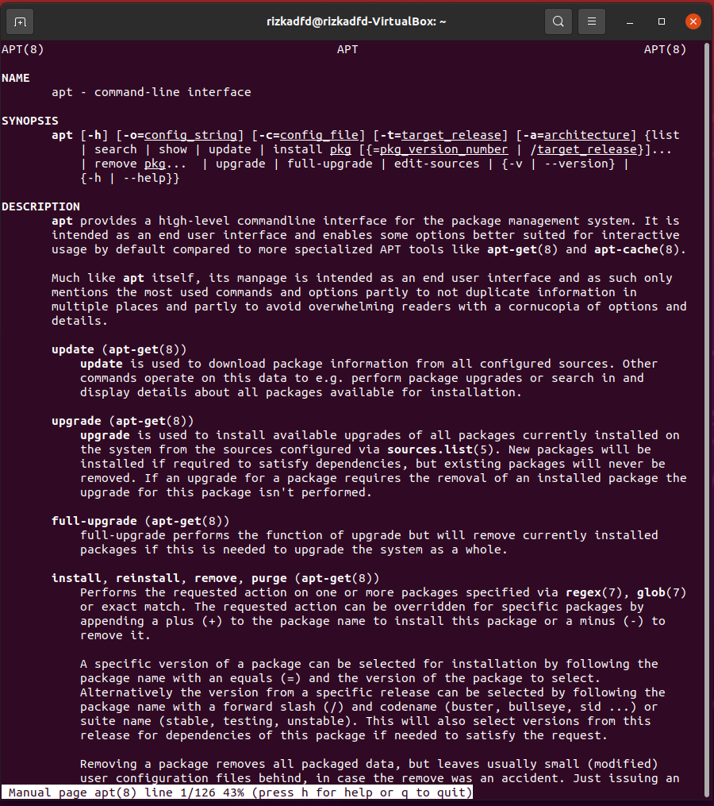

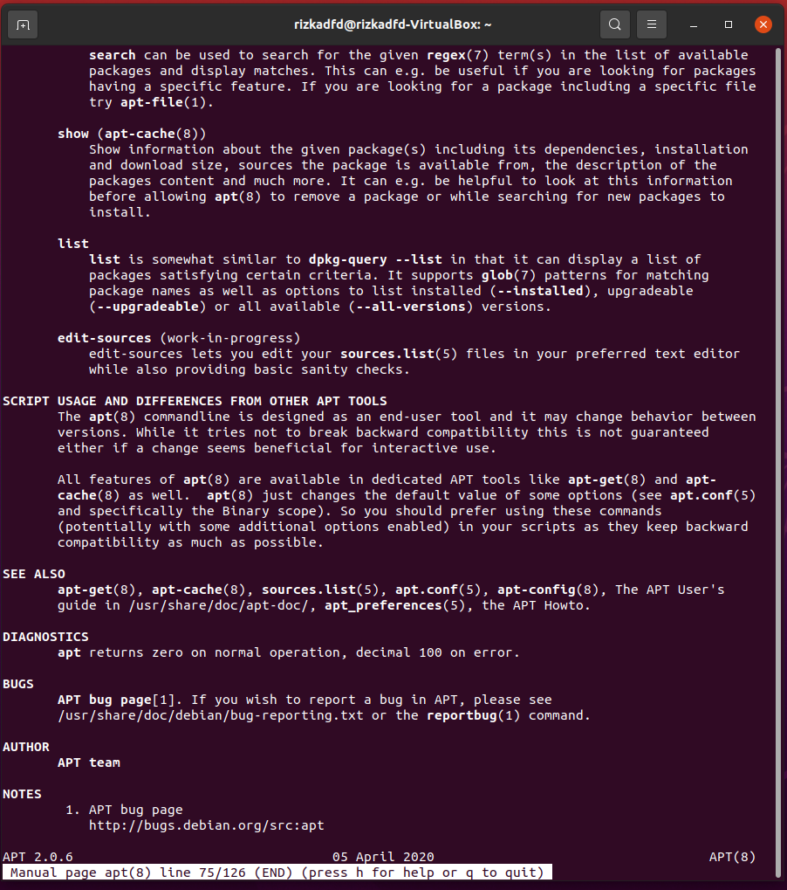

Perintah "man apt" pada Ubuntu digunakan untuk menampilkan manual penggunaan dari perintah apt, yaitu paket manajemen yang digunakan untuk menginstal, menghapus, dan mengelola paket aplikasi pada sistem operasi Linux. Berikut adalah beberapa opsi umum yang dapat digunakan dalam 
perintah 

    "man apt":

Untuk menampilkan manual penggunaan dari perintah apt, cukup ketikkan perintah "man apt"
Untuk menginstal sebuah paket, gunakan perintah "apt install".

    sudo apt install nama-paket

Untuk menghapus sebuah paket, gunakan perintah "apt remove". 

    sudo apt remove nama-paket

Untuk melakukan update daftar paket, gunakan perintah "apt update". 

    sudo apt update

Untuk melakukan upgrade paket yang sudah terinstal, gunakan perintah "apt upgrade". 

    sudo apt upgrade

Untuk mencari paket yang tersedia di repository, gunakan perintah "apt search". 

    apt search nama-paket

Untuk menampilkan informasi detail dari sebuah paket, gunakan perintah "apt show". 

    apt show nama-paket

Perintah-perintah di atas adalah beberapa perintah yang umum digunakan dalam perintah apt pada Ubuntu. Anda dapat menemukan opsi dan perintah yang lebih lengkap dengan menjalankan perintah "man apt" pada terminal.

 
 

### **<h2 style="text-align: center;">Sekian Terimakasih</h2>**

