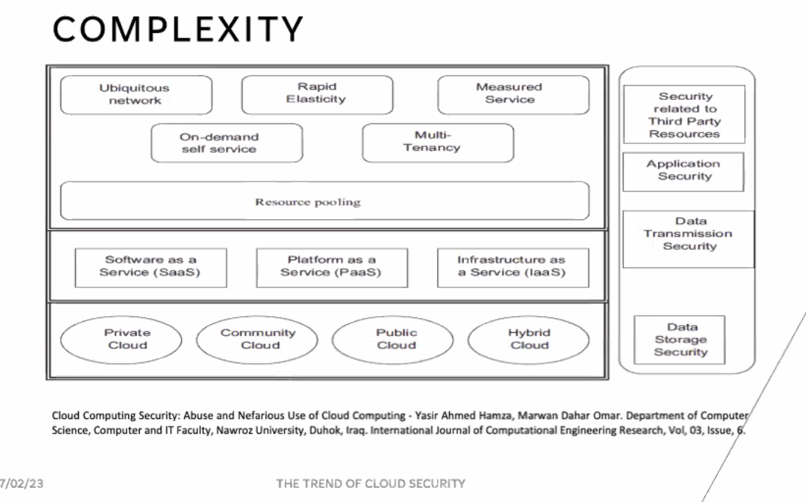
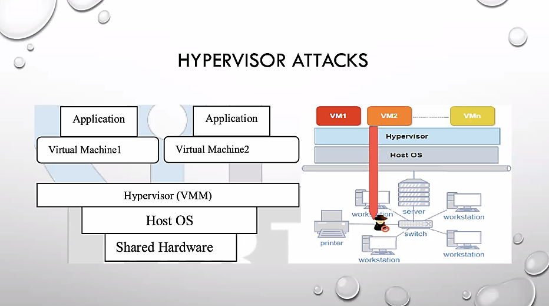
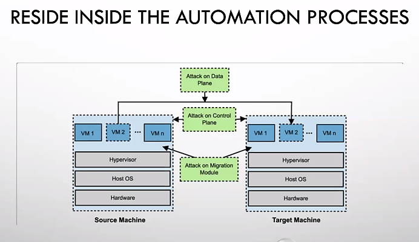
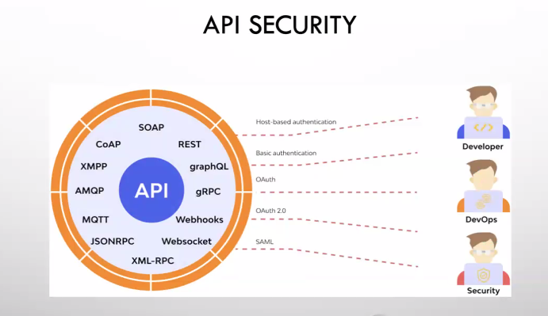
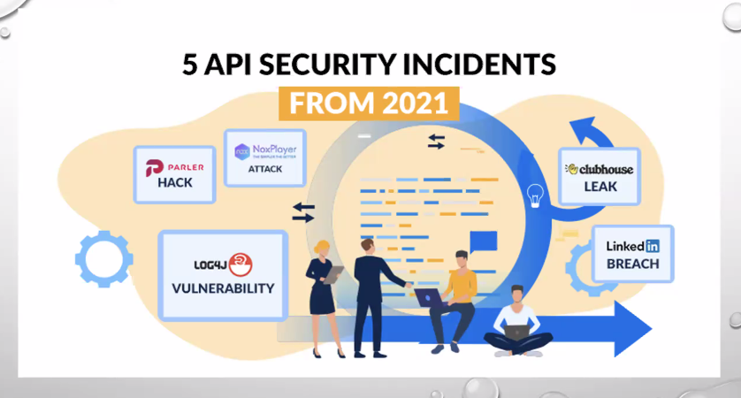
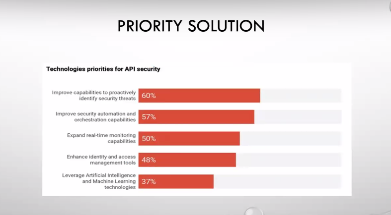
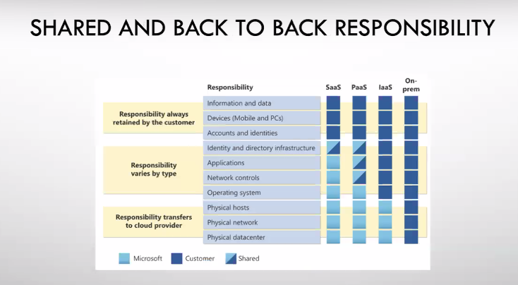

**Workshop Administrasi Jaringan**

Diampu oleh 
Dr. Ferry Astika Saputra ST, M.Sc.

** Resume : The Trend of Cloud Security**

 Disusun Oleh 
Rizka Dwi Fajriyah Darmayanti 
3121600050; 2 D4 IT B

   PROGRAM STUDI TEKNIK INFORMATIKA 
POLITEKNIK ELEKTRONIKA NEGERI SURABAYA 
PEMERINTAH KOTA SURABAYA 
TAHUN 2023 

  

# Agenda

1.	The Threats
2.	The Attacks
3.	The Security
4.	The Tools
5.	The Tests
6.	Summary

 

# Introduction
Komputasi awan adalah model yang menawarkan layanan komputasi instan tanpa menanggung biaya. Namun demikian, seperti teknologi lainnya, ini membawa kekurangannya. Salah satu masalah utama adalah masalah keamanan dan privasi termasuk kebocoran data karena infrastruktur sumber daya komputasi bersama untuk memproses informasi bisnis rahasia - seperti kekayaan intelektual, rahasia dagang, dan informasi rahasia pelanggan, yang dapat menyebabkan aktor yang tidak sah dapat mengaksesnya.

 

## 1. The Threads

### 1.1. Data Loss and Data Leakage;
Sebagian besar fitur Perlindungan Data Cloud untuk Perusahaan ditawarkan secara terpisah sebagai layanan opsional dan extended services e.g. penyimpanan tambahan untuk retensi snapshot dan anti-ransomware karena sumber dayanya banyak dan mahal.

 

### 1.2. Abuse and Nefarious Use;
Karena Cloud Computing adalah ekosistem berbagai layanan, interaksi, dan saling ketergantungan, menjadi lebih lazim. Eksploitasi (PaaS) untuk "Hacking as a Service" bisa lebih menantang untuk dimitigasi karena tersembunyi di infrastruktur yang sama.

 

### 1.3. Insecure Interface and APIs;
Mengeksploitasi insecure API yang di multitenancy environment dapat increase the risk of business espionage) meningkatkan risiko spionase bisnis), yang berpotensi mengakibatkan kompromi atau pencurian data sensitif dan pribadi.

 

### 1.4. Shared Technology Issues;
Penyedia layanan cloud menggunakan infrastruktur terukur untuk mendukung banyak penyewa yang berbagi infrastruktur dasar. Di lapisan paling bawah, di mana hypervisor dapat dieksploitasi dari mesin virtual yang disusupi di penyewa lain untuk mendapatkan akses ke semua VM di shared environment bersama yang sama.

**Hypervisor Attacks**

 

**Reside Inside The Automation Processes**

 

**Virtualisasi**

Virtualisasi merupakan sebuah teknologi yang memungkinkan satu infrastruktur fisik berfungsi sebagai beberapa infrastruktur atau sumber daya logis, mengurangi jumlah besar yang diinvestasikan untuk membeli sumber daya tambahan adalah teknik, yang mengikuti pembagian satu contoh fisik aplikasi atau sumber daya di antara banyak organisasi atau penyewa.
Virtualisasi perangkat keras adalah abstraksi sumber daya komputasi dari perangkat lunak yang menggunakan sumber daya tersebut. 

Virtualisasi perangkat keras juga disebut virtualisasi server, virtualisasi perangkat keras menginstal hypervisor atau manajer mesin virtual (VMM), yang menciptakan lapisan abstraksi antara perangkat lunak dan perangkat keras yang mendasarinyaLingkungan virtualisasi dikelola oleh perangkat lunak atau firmware, yang dikenal sebagai hypervisor. Hypervisor rentan terhadap semua jenis serangan untuk infrastruktur normal.

 

**API Security**

 

**5 API Security Incidents**

 

**Piority Solution**

 

**Shared and Back to Back Responsibility**

 

## 2. The Attack
### Virtual Machine Level Attack
Serangan pada platform cloud yang sama dapat memengaruhi penyewa lainnya, terutama jika serangan tersebut berhasil menembus lapisan virtualisasi dan menginfeksi VM lain di lingkungan yang sama. Oleh karena itu, untuk memastikan keamanan lingkungan cloud, penting untuk menerapkan praktik keamanan yang tepat, termasuk mengeraskan lapisan virtualisasi.
Mengeraskan lapisan virtualisasi melibatkan penggunaan teknologi dan konfigurasi yang tepat untuk mengisolasi dan melindungi VM dari serangan yang mungkin berasal dari VM lain di lingkungan yang sama. Ini bisa mencakup:
1.	Menggunakan teknologi virtualisasi yang aman dan memiliki fitur keamanan yang kuat, seperti hypervisor yang dikonfigurasi dengan baik dan mekanisme isolasi untuk VM.
2.	Menggunakan teknik isolation yang tepat untuk memisahkan VM satu sama lain, seperti memastikan setiap VM memiliki jaringan dan konfigurasi keamanan yang terpisah.
3.	Menerapkan tindakan keamanan tambahan seperti firewall, pemantauan aktivitas pengguna, dan enkripsi data.
Namun, penting untuk diingat bahwa tidak ada solusi keamanan yang sempurna. Bahkan dengan menerapkan semua praktik keamanan yang tepat, masih ada kemungkinan terjadinya serangan. Oleh karena itu, penting juga untuk memperbarui dan memperbaiki sistem keamanan secara teratur, serta melakukan pemantauan aktif untuk mendeteksi dan merespons serangan yang terjadi secepat mungkin.

### Service and Session Hijacking
### Man in the cloud dan DDoS

 

## 3.	The Security
### Cloud Control Layer
Gunakan Cloud Control Layer tambahan dalam manajemen Cloud dari 3% penyedia solusi pihak, terutama untuk penyebaran multi-cloud.
### Shared Responsibilities 
Gunakan "perjanjian back-to-back" dengan Penyedia Cloud Anda untuk memastikan kepatuhan standar keamanan penuh.

 

## 4.	The Tools
Keamanan yang Ditetapkan Perangkat Lunak; yakinkan kembali solusi Keamanan Cloud tertinggi yang tersedia. Otentikasi Multifaktor Kemajuan AAA untuk setiap Lapisan Cloud misalnya kombinasi biometrik wajib.

 

## 5.	The Tests

1.	Isolasi Sumber Daya Cloud; mencegah serangan pivot VM ke VM.
2.	Periksa Masalah Penguncian; cegah terjebak dalam produk yang rentan.
3.	Periksa Masalah Tata Kelola; yakinkan kembali standar praktik terbaik.
4.	Periksa Masalah Kepatuhan; hindari sanksi dan hukuman.
5.	Periksa Integritas Data, Retensi, dan Pembuangan; mencegah kebocoran dan kerugian.

 

# SUMMARY
Diskusi ini mengangkat masalah keamanan terkait layanan cloud. Perlu dicatat bahwa penjahat dunia maya telah mengeksploitasi kerentanan ekosistem bersama dan kurangnya langkah-langkah keamanan yang efektif, yang menyebabkan penyalahgunaan platform. Peretas dapat secara ilegal mendapatkan akses ke informasi rahasia penyewa lain yang berada di infrastruktur cloud yang sama. Dengan demikian, organisasi didorong untuk melakukan penilaian risiko berkelanjutan untuk mengurangi potensi ancaman terhadap informasi sensitif mereka. Selain itu, vendor keamanan cloud harus meningkatkan perlindungan dengan menerapkan perlindungan proaktif yang lebih canggih dan canggih untuk mengatasi tantangan ini.

 
 

### **<h2 style="text-align: center;">Sekian Terimakasih</h2>**

